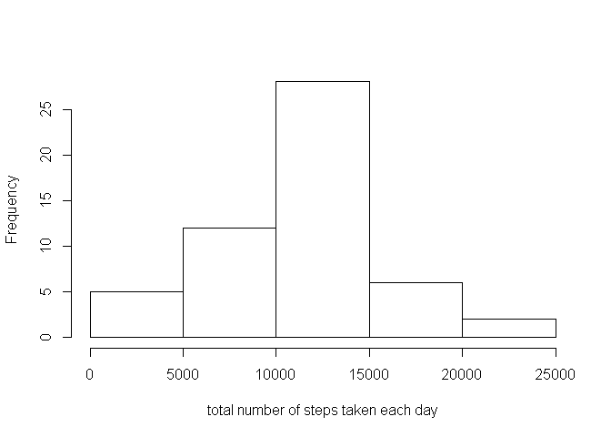
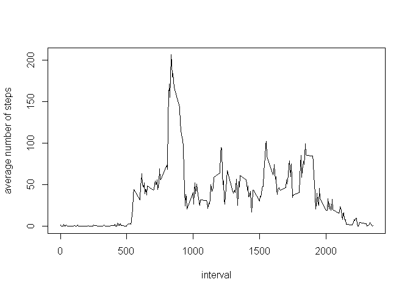
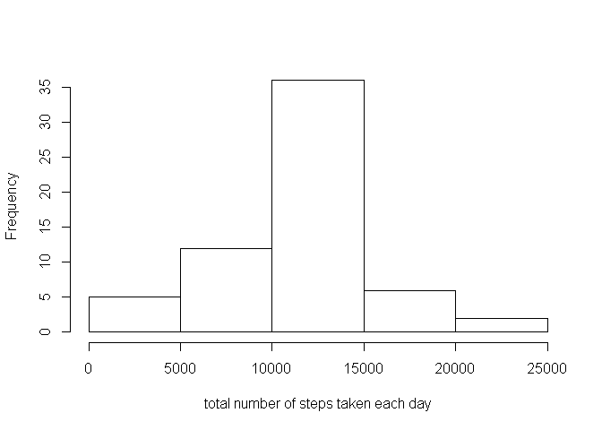
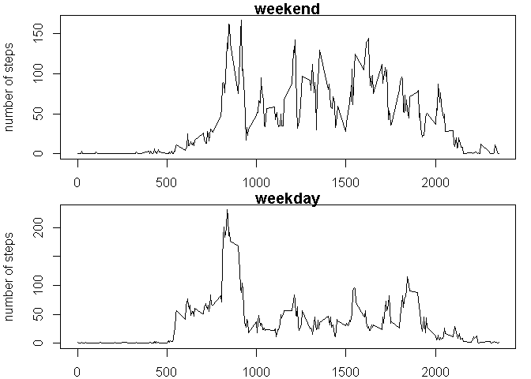

# Reproducible Research: Peer Assessment 1


## Loading and preprocessing the data

```r
act <- read.csv("activity.csv")
act_by_date <- aggregate(steps~date,act,sum)
hist(act_by_date$steps,main='',xlab='total number of steps taken each day')
```

<!-- -->


## What is mean total number of steps taken per day?

```r
act_summary <- summary(act_by_date$steps)
act_summary[4]
```

```
##  Mean 
## 10770
```

```r
act_summary[3]
```

```
## Median 
##  10760
```


## What is the average daily activity pattern?

```r
act_by_interval <- aggregate(steps~interval,act,mean)
plot(act_by_interval$interval,act_by_interval$steps,type="l",xlab='interval',ylab='average number of steps')
```

<!-- -->

### Which 5-minute interval, on average across all the days in the dataset, contains the maximum number of steps?

```r
act_by_interval[which.max(act_by_interval$steps),]
```

```
##     interval    steps
## 104      835 206.1698
```

## Imputing missing values
to impute missing ('NA') value for a particular date/interval combination data point, replace with mean of non-NA values for that same interval for all other dates 

```r
sum(is.na(act$steps))
```

```
## [1] 2304
```

```r
act_imputed <- act
for (j in which(is.na(act_imputed[, 'steps']))) {
  act_imputed[j,'steps'] <- mean(act_imputed[act_imputed[, "interval"] == act_imputed[j, "interval"], "steps"],  na.rm = TRUE)
}

act_by_date <- aggregate(steps~date,act_imputed,sum)
hist(act_by_date$steps,main='',xlab='total number of steps taken each day')
```

<!-- -->


## What is mean total number of steps taken per day?

```r
act_summary <- summary(act_by_date$steps)
act_summary[4]
```

```
##  Mean 
## 10770
```

```r
act_summary[3]
```

```
## Median 
##  10770
```

Note that after imputing values (replacing 'NA' values with mean for the non-NA values for that 5 minute interval for all other days), the mean has remained unchanged, while the median has slightly incresed to match the mean.


## Are there differences in activity patterns between weekdays and weekends?

```r
act_imputed$daytype <- ifelse(weekdays(as.POSIXct(act_imputed$date)) %in% c("Saturday","Sunday"),"weekend","weekday")
act_weekday_int <- aggregate(steps~interval,subset(act_imputed,daytype =='weekday'),mean)
act_weekend_int <-
aggregate(steps~interval,subset(act_imputed,daytype =='weekend'),mean)
par(mfrow=c(2,1),mar=c(2,4,1,1))
plot(act_weekend_int$interval,act_weekend_int$steps,type="l",main='weekend',xlab='',ylab='number of steps')
plot(act_weekday_int$interval,act_weekday_int$steps,type="l",main='weekday',xlab='interval',ylab='number of steps')
```

<!-- -->

```r
graphics.off()
```

we see that the maximum number of steps is higher for weekday activity, but that there is more mid-day activity on weekends than weekdays


